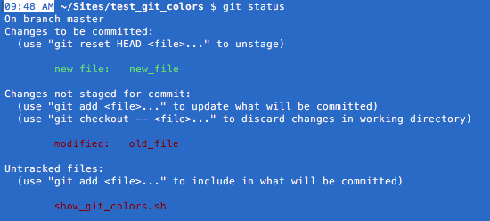
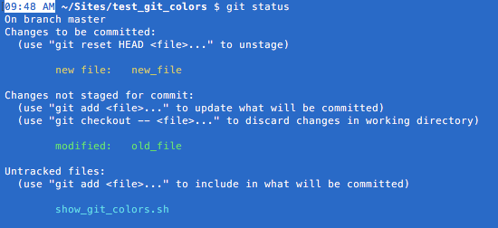

# Git Tips

# Table of Contents

* [Legend  ](https://github.com/Michaelangel007/git_tips#legend)
* [Aliases ](https://github.com/Michaelangel007/git_tips#aliases)
* [Branches](https://github.com/Michaelangel007/git_tips#branches)
* [Config  ](https://github.com/Michaelangel007/git_tips#config)
* [Commit  ](https://github.com/Michaelangel007/git_tips#commit)
* [Diffs   ](https://github.com/Michaelangel007/git_tips#diffs)
* [Preview ](https://github.com/Michaelangel007/git_tips#preview)


## Legend:

|Placeholder  | Description                 |
|:------------|:----------------------------|
|`<branch>`   | Branch name                 |
|`[<parent>]` | Optional parent branch name |
|`<branch1>`  | Branch name                 |
|`<branch2>`  | Branch name                 |
|`<commit>`   | Commit SHA1 hash            |
|`<file>`     | File to add to repository   |
|`<old>`      | Old filename or branch name |
|`<new>`      | New filename or branch name |
|`<user>`     | Git Hub user                |
|`<project>`  | Git Hub repository          |


## Aliases

`~/.gitconfig` is a plain-text file in INI format.

i.e.

```
[alias]
    tree = log --graph --all --format=format:'%C(bold blue)%h%C(reset) - %C(bold green)(%ar)%C(reset) %C(white)%s%C(reset) %C(bold white).%an%C(reset)%C(bold yellow)%d%C(reset)' --abbrev-commit --date=relative
```

Then you can see a visual tree via `git tree`


## Branches

* Create from existing files and switch to newbranch: `git checkout -b <newbranch> [<parent>]`
* Compare file in different branchs: `git diff <branch1> <branch2> <file>`
 or `git diff <branch1>:<file1> <branch2>:<file2>`
* Delete **local** branch: `git branch -d <delbranch>`
* Delete **remote** branch: `git push origin -D <delbranch>`
* **Merge** _all_ commits from _master_ into development branch _Foo_: `git checkout Foo; git merge master`
* Merge _single_ commit from different branch: `git cherry-pick <commit>`
* Rename branch: `git branch -mv <oldbranch> <newbranch>`
* Rename branch (lazy): `git push origin 'refs/heads/<oldbranch>:refs/heads/<newbranch>'
* Resolve conflicts: `git merge <incbranch>`
* Show branches: `git log --graph --pretty=format:'%C(magenta)%h%Creset -%C(red)%d%Creset %s %C(dim green)(%cr) %C(cyan)<%an>%Creset' --abbrev-commit`


## Config

|Where  | Command                  |
|:------|:-------------------------|
|Global | `$(EDITOR) ~/.gitconfig` |
|Project| `$(EDITOR) .git/config`  |
|Global  Password manager|`git config --global credential.helper`|
|Project Password manager|`git config          credential.helper`|

On OSX `credential.helper` will be `osxkeychain` if you are using `Applications/Utilites/Keychain Access` to cache your credentials.

See [Caching your GitHub password in Git](https://help.github.com/articles/caching-your-github-password-in-git/#platform-linux)

If you password has changed see [Updating credentials from the OSX Keychain](https://help.github.com/articles/updating-credentials-from-the-osx-keychain/)

To delete your cached password: `git credential-osxkeychain erase`

### Current config

* Show all current global configs: `git config --global -l`


### Colors

* Color Names: `git log -1 --pretty=format:"%Credred%Creset %Cgreengreen%Creset %C(Yellow)yellow%Creset %Cblueblue%Creset %C(magenta)magenta%Creset %C(cyan)cyan%Creset %C(white)white%Creset"`

* Color

    | Color    |
    |:---------|
    | `blue`   |
    | `cyan`   |
    | `green`  |
    | `magenta`|
    | `red`    |
    | `white`  |
    | `yellow` |

* Attribute

    | Attribute |
    |:----------|
    | `blink`   |
    | `bold`    |
    | `dim`     |
    | `italic`  |
    | `reverse` |
    | `ul`      |

* 24-bit color: `git log --format="%h%C(#ff69b4)%d%C(reset) %s"`

* Underline hash via `ul` and `noul`: `git log --format="%C(magenta ul)%h%C(white noul) %s"`

* Status colors

    

    ```
    [color "status"]
      added = yellow
      changed = green  # default: red
      untracked = cyan # default: red
    ```

    


### Email and Name

    [user]
        name  = First Last
        email = First_Last@test.com

### Ignore Files

|Where  | Command                                                    |
|:------|:-----------------------------------------------------------|
|Global | `git config --global core.excludesfile ~/.gitignore_global`|
|Project| `touch .gitignore && $(EDITOR) .gitignore`                 |

* See templates @ https://github.com/github/gitignore


## Commit

Legend of commit hash aliases:

|Alias       |Description                          |
|:-----------|:------------------------------------|
|`<commit>`  |Specific commit                      |
|`HEAD`      |Current head                         |
|`HEAD~#`    |Previous #-th commit relative to head|
|`HEAD^`     |Parent of head                       |
|`<commit>^` |Parent of specific commit            |
|`<commit>^^`|Grand-parent of specific commit      |

* Create new repo: `git init`

* Show state of local files (_staged_, _modified_, _untracked_): `git status --short`

* Add (new or existing) file to be staged: `git add <file>`
  * Undo file from add (unstage): `git reset <file>`

* Add **partial change(s)** of file: `git add -p <file>` (See [SO #1085162](http://stackoverflow.com/questions/1085162/commit-only-part-of-a-file-in-git))

* Commit staged file(s): `git commit -m "Message"`
  * Add and commit all changed files only: `git commit -a -m "Message"`

* Append files to last commit

    ```
    git add <file>
    git commit --amend
    ```

* Pull from Remote

    |Description            | Command                                                         |
    |:----------------------|:----------------------------------------------------------------|
    |Ask username & password|`git pull -v` |

* Push to Remote

    |Description          | Command                                                         |
    |:--------------------|:----------------------------------------------------------------|
    |View remote URLs set | `git remote -v`                                                 |
    |Set remote (initial) | `git remote add origin https://github.com/<User>/<project>.git` |
    |Push remote (initial)| `git push -u origin master`                                     |
    |Push remote          | `git push`                                                      |

* Merge

  |Description              |Command                         |
  |:------------------------|:-------------------------------|
  |Show SHA1 of last commit |`git log -1 --format=format:%H` |
  |Merge start              |`git mergetool`                 |
  |Undo (**local** merge)   |`git reset --hard <commit>`     |
  |Merge done               |`git commit`                    |
  |Undo (**remote** merge)  |`git revert -m 1 <commit>`      |

  **Notes:**

  * `mergetool` may default to _none_
  * Should NOT need to force push: `git push origin master --force`
  * Undo remote merge see [SO #11722533](http://stackoverflow.com/questions/11722533/rollback-a-git-merge)
    * `-m 1` first parent of the merge commit on the master branch
    * `-m 2` first parent on the develop branch where the merge came from initially

* Move or Rename file: `git mv <old> <new>`

* Show

  |Description                   |Command                                                  |Example|
  |:-----------------------------|:--------------------------------------------------------|:------|
  | Visual tree                  | See Aliases                                             | |
  | Full Details of commit / File| `git show             <commit>:[<file>]`                |<pre>commit b88f8a267bc93ab43c440b81e5ac95e6943d5c98<br>Author: ...<br>Date:   ...<br><br>    ...description...<br><br>diff --git a/README.md b/README.md<br>index 3e6c965..0b26797 100644<br>--- a/README.md<br>+++ b/README.md<br>@@ -182,10 +182,10 @@ Legend of commit hash aliases:</pre>|
  | Diff only of commit / File   | `git show --format=%d <commit>:[<file>]`                |<pre>diff --git a/README.md b/README.md<br>index 3e6c965..0b26797 100644<br>--- a/README.md<br>+++ b/README.md<br>@@ -182,10 +182,10 @@ Legend of commit hash aliases:<br></pre>|
  | Diffs for last `#` commits   | `git show -# <file>`                                    | |
  | Summary of +/- changes       | `git show --stat <commit>`                              |<pre>commit b88f8a267bc93ab43c440b81e5ac95e6943d5c98<br> Author: ...<br> Date:   ...<br> <br>    ...description...<br><br> README.md &#124; 2 +-<br> 1 file changed, 1 insertion(+), 1 deletion(-)<br></pre>|
  | Log _all_ commits            | `git log`                                               | |
  | Log _last `#`_ commits       | `git log -#`                                            | |
  | Log of summary only          | `git log -2 --format=%B`                                |<pre>Merge branch 'master' of https://...<br><br>Move ...</pre>                                              |
  |**Type and filenames only**   | `git log -2 --name-status --format=        [<branch>]`  |<pre>M       README.md<br>M       README.md</pre>                                                            |
  | List of filenames only       | `git log -2 --name-only   --format=        [<branch>]`  |<pre>README.md<br>README.md</pre>                                                                            |
  | Log of hash + filenames      | `git log -2 --name-only --pretty=format:%H [<branch>]`  |<pre>868b8a2dc91eed45242e8d4ebb3aabd5b1965c47<br>b88f8a267bc93ab43c440b81e5ac95e6943d5c98<br>README.md </pre>|
  | Log of hash, summary, file   | `git log -2 --name-only --oneline`                      |<pre>868b8a2 Merge branch 'master' of https://...<br>Move ...<br>README.md</pre>                             |
  | SHA1 hash of last commit     | `git log -2 --format:%H`                                |<pre>868b8a2dc91eed45242e8d4ebb3aabd5b1965c47<br>b88f8a267bc93ab43c440b81e5ac95e6943d5c98</pre>              |
  | Status of changed files      | `git diff-tree --no-commit-id -r --name-status HEAD`    |<pre>M      README.md</pre>                                                                                  |
  |                              | `git diff-tree --no-commit-id -r --name-status <commit>`|                                                                                                             |
  | ... last commit              | `git diff-tree --no-commit-id -r --name-status $(git log -1 --format=format:%H)`|                                                                                     |
  |**Summary of last commit +/-**| `git diff --stat HEAD^!`                                |<pre>README.md &#124; 2 +-<br> 1 file changed, 1 insertion(+), 1 deletion(-)</pre>                           |

  **Note:**

  * Show is _relative_ to **root of repository**, _NOT_ your current directory.

* Undo all local changes to `<file>` (reset file): `git checkout -- <file>`

## Diffs

|Description                    | Command                    |
|:------------------------------|:---------------------------|
|Before add, all    file changes| `git diff`                 |
|Before add, single file changes| `git diff <file>`          |
|After  add, single file changes| `git diff --staged <file>` |
|Compare to previous commit     | `git diff HEAD^`           |

* View Whitespace

  * Use: `git diff --ws-error-highlight=all`

  * Make alias

    ```
    git config --global alias.df 'diff --ws-error-highlight=all'
    git df <file>
    ```

### P4Merge

To use P4Merge for Diffs and 3-Way Merges instead of built-in git tools:

* For `git difftool`

    ```
    git config --global diff.tool p4merge
    git config --global difftool.p4merge.path "/Applications/p4merge.app/Contents/Resources/launchp4merge"
    git config --global difftool.keepTemporaries false
    git config --global difftool.prompt false
    git config --global difftool.trustExitCode false
    ```

    Which updates git config as:

    ```
    [diff]
        tool = p4merge
    [difftool "p4merge"]
        path = /Applications/p4merge.app/Contents/Resources/launchp4merge
    [difftool]
        keepTemporaries = false
        trustExitCode = false
        prompt = false
    ```

* For `git mergetool`

    ```
    git config --global merge.tool p4merge
    git config --global mergetool.p4merge.path "/Applications/p4merge.app/Contents/MacOS/p4merge"
    git config --global mergetool.keepTemporaries false
    git config --global mergetool.prompt false
    git config --global mergetool.trustExitCode false
    ```

## Preview

### HTML

* Preview HTML in a git repo:

    ```
    http://htmlpreview.github.io/?https://raw.githubusercontent.com/<user>/<project>/<branch>/<file>
    ```

Note: Branch is usually `master`

### Markdown

* Editor: [https://jbt.github.io/markdown-editor/](https://jbt.github.io/markdown-editor/)

* Add `png` to `README.md`: ``

* Escape `|` in tables: [SO 17319940]()http://stackoverflow.com/questions/17319940/how-to-escape-a-pipe-char-in-a-code-statement-in-a-markdown-table/17320389

* [x] TODO list: use `* [x] Task`


# See:

* [Git Tips](https://github.com/Michaelangel007/git_tips)
* [Git Cheat Sheet](https://github.com/Michaelangel007/git_cheat_sheet)
